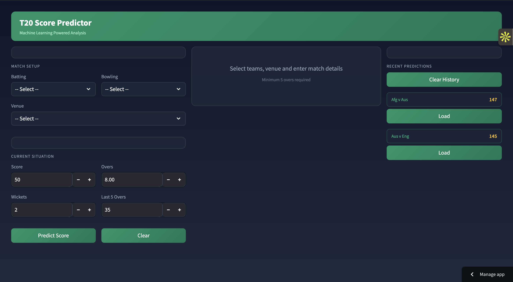
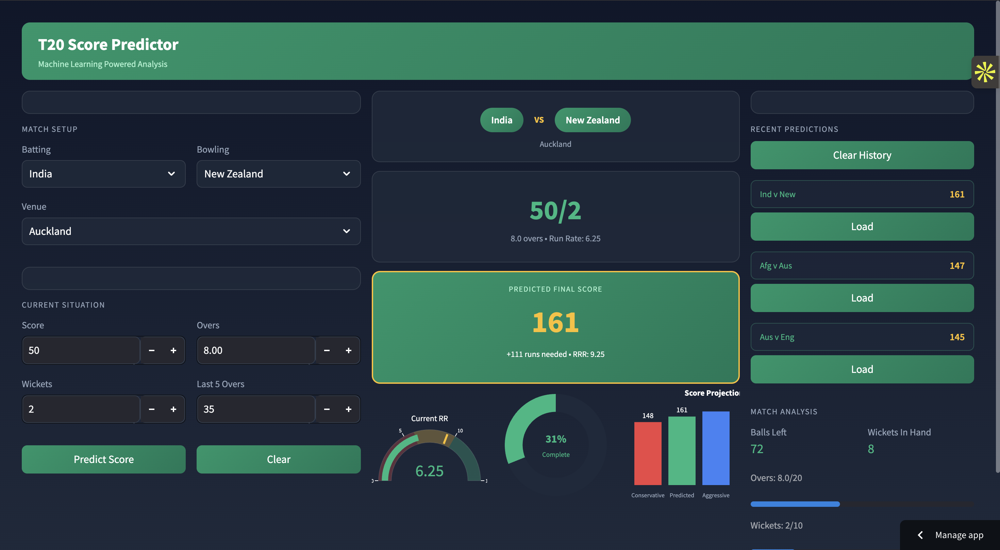

# 🏏 T20 Cricket Score Predictor

An end-to-end machine learning project that predicts the **final T20 cricket score of the batting team** based on live match conditions. The system performs full data engineering, model training, and deployment via a Streamlit web application.

This project demonstrates applied sports analytics and real-time predictive modeling.

---

## 🌐 Live App

Try the deployed app here: [https://t20-score-predict.streamlit.app/](https://t20-score-predict.streamlit.app/)

---

## 📌 Project Overview

The objective is to build a predictive model that estimates the final T20 score using match context such as current score, overs, wickets, and recent performance. The solution follows a complete ML pipeline from raw YAML match data to an interactive web interface. 

---

## 🚀 Key Features

* End-to-end ML pipeline
* YAML-to-dataframe conversion
* Advanced feature engineering
* Multi-model comparison
* Best-model selection
* Streamlit prediction dashboard
* Real-time score estimation

---

## 🧠 Problem Statement

Predict the **final innings score** of a T20 batting team using in-match features to assist:

* Teams and analysts
* Broadcasters
* Fantasy sports users
* Cricket data enthusiasts

The model helps generate strategic insights during live matches. 

---

## 📂 Project Structure

```
T20_Score_Predictor/
│
├── Dataset/
│   └── t20s/
│
├── Training/
│   └── Training.ipynb
│
├── Model/
│   └── pipe.pkl
│
├── web.py
├── requirements.txt
└── README.md
```

---

## 🔄 End-to-End Pipeline

```
YAML Match Data → Preprocessing → Feature Engineering → Model Training → Best Model → Streamlit App
```

---

## 📊 Data Processing Pipeline

### Step 1 — Data Collection

* Historical T20 match data downloaded from Kaggle
* Raw data stored as YAML files
* Converted into structured DataFrames

The system iterates through YAML files and builds a unified dataset. (see code workflow on page 6)

---

### Step 2 — Data Cleaning & Filtering

Key preprocessing steps:

* Dropped unnecessary metadata columns
* Filtered only **men’s T20 matches**
* Removed 50-over matches
* Eliminated teams with insufficient data
* Handled null values

This ensures training stability and data balance.

---

### Step 3 — Feature Engineering

The model uses carefully engineered cricket features:

* Batting team
* Bowling team
* City
* Current score
* Balls left
* Wickets left
* Current run rate (CRR)
* Runs in last 5 overs

These features were selected after iterative EDA and domain reasoning. (see feature creation workflow on pages 10–11)

---

### Step 4 — Train/Test Split

* Dataset split in **80:20 ratio**
* Randomized sampling applied
* Final dataframe cleaned before training

---

## 🤖 Models Implemented

Three regression algorithms were evaluated:

### 1️⃣ Linear Regression

* Accuracy ≈ **68%**

### 2️⃣ Random Forest Regressor

* Accuracy ≈ **~97%**

### 3️⃣ XGBoost Regressor

* Accuracy ≈ **~98% (Best Model)**

XGBoost was selected and saved as the production pipeline. 

---

## 🌐 Streamlit Web Application

The trained pipeline is deployed via Streamlit.

### User Inputs

* Batting team
* Bowling team
* City
* Current score
* Overs completed
* Wickets out
* Runs in last 5 overs

### Output

```
Predicted Score: XXX
```

The UI dynamically computes balls left and feeds the model. (UI example shown below)

---

## 🖼️ App Screenshots

### Initial View



### Prediction Result Example



---

## ⚙️ Installation & Setup

### 1️⃣ Clone Repository

```bash
git clone <your-repo-url>
cd T20_Score_Predictor
```

---

### 2️⃣ Create Virtual Environment

**macOS/Linux**

```bash
python -m venv venv
source venv/bin/activate
```

**Windows**

```bash
python -m venv venv
venv\Scripts\activate
```

---

### 3️⃣ Install Dependencies

```bash
pip install -r requirements.txt
```

If needed:

```bash
pip install streamlit xgboost scikit-learn
```

---

## 🧪 Run Training (Optional)

```bash
jupyter notebook Training/Training.ipynb
```

This performs:

* YAML parsing
* Feature engineering
* Model training
* Evaluation
* Pipeline export

---

## ▶️ Run the Web App

```bash
streamlit run web.py
```

Open:

```
http://localhost:8501
```

---

## 📈 Evaluation Metrics

Models evaluated using:

* R² Score
* Mean Absolute Error (MAE)

XGBoost achieved the highest predictive performance.

---

## 💡 Use Cases

* Live match analytics
* Broadcast score projections
* Fantasy cricket strategy
* Team decision support
* Sports data science research

---

## 🛠️ Tech Stack

* Python
* Pandas & NumPy
* Scikit-learn
* XGBoost
* YAML parsing
* Streamlit
* Matplotlib / Seaborn

